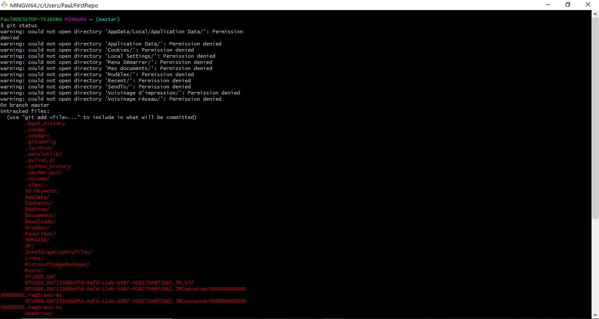
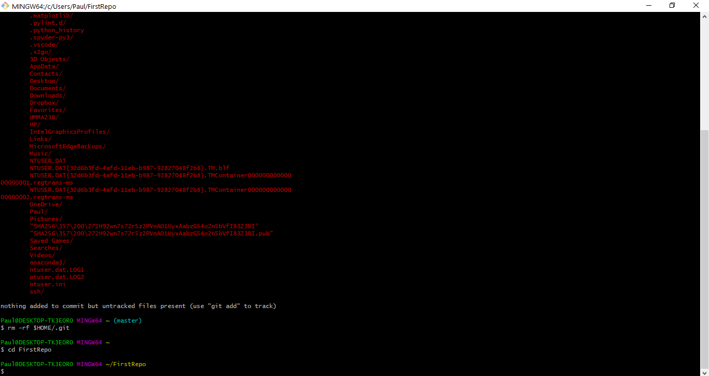

## **How to fix git init on home directory**

You accidently ran a **`git init`** on the home directory (the wrong directory root) ? 
Moreover, you realize that when you make a **`git status`** all the folders on your computer appear like my friend Paolo ?
No worries dude :)

#### For UNIX-like users

If you have added/committed the files, you may :
+ Create a new directory root,
+ Copy the location **`/home/user/.git`** in this new directory.
+ Then do a **`git checkout HEAD --`**

After that, if there are **no apparent problems** , you can fix this problem by deleting .git (the subdirectory) with the command : **`rm -rf $HOME/.git `**

##### NB : The variable `$HOME` is used for the user location `/home/user` in UNIX system

After that, try to redo  **`git init`** in the right directory 

#### For Windows users :

You have installed GIT on your Windows computer and set the root directory to the user's directory **`c:/users/user`**
You can apply what has been said above and delete **`c:/users/user/.git`**

